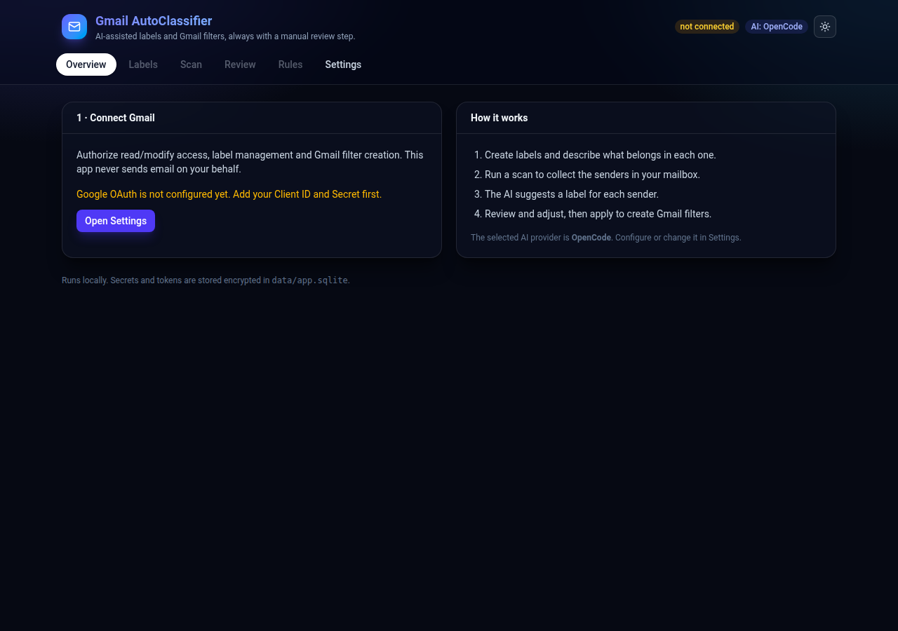

# Gmail AutoClassifier

[](https://github.com/180Gio/gmail-autoclassifier/actions/workflows/ci.yml)

An AI-assisted Gmail organizer that turns the senders in your mailbox into
**labels and Gmail filters** — always behind a manual review step.

You describe, in plain language, what belongs in each label. The app scans your
mail, asks an AI to assign a label to each sender, shows you an editable preview,
and only writes Gmail filters after you explicitly confirm.

> Runs entirely on your machine. Your Google tokens and API keys are stored
> encrypted in a local SQLite file. No third-party server is involved beyond the
> AI provider you choose.



---

## Table of contents

- [What it does](#what-it-does)
- [How it works](#how-it-works)
- [Requirements](#requirements)
- [Quick start](#quick-start)
- [Configuration](#configuration)
- [Using the app](#using-the-app)
- [AI providers](#ai-providers)
  - [OpenCode](#opencode)
  - [OpenAI-compatible](#openai-compatible)
  - [Mock](#mock)
  - [Adding your own provider](#adding-your-own-provider)
- [Security and privacy](#security-and-privacy)
- [Gmail API notes](#gmail-api-notes)
- [Project structure](#project-structure)
- [Scripts](#scripts)
- [Roadmap](#roadmap)
- [License](#license)

---

## What it does

- Connects to your Gmail account with OAuth.
- Imports your existing labels and lets you create new ones.
- Lets you write a **description** for each label (what should go in it).
- Scans recent mail and extracts every distinct sender, with counts and sample
  subjects.
- Asks an AI provider to suggest one or more labels per sender.
- Shows a **review screen** where you accept, reject, or change every suggestion.
- Creates Gmail labels (if missing) and **Gmail filters** for the accepted
  senders, with configurable actions:
  - apply one or more labels,
  - archive (skip the inbox),
  - mark as read,
  - never send to spam,
  - optionally apply the same changes to **existing** mail (backfill).
- Keeps a list of the filters it created, and lets you delete them from the app.
- Lists **every filter in Gmail** (including ones created outside the app) so you
  can review and remove them.
- Modern glass UI with light/dark mode, and a settings screen that shows only the
  fields of the selected AI provider.

## How it works

```
┌────────────┐    1. connect      ┌──────────────┐
│  Gmail API │◄───────────────────│              │
│            │  2. list labels    │  Express API │
│  labels    │  3. scan senders   │  (local)     │
│  messages  │  4. create filters │              │
│  filters   │◄───────────────────│   SQLite     │
└────────────┘                    └──────┬───────┘
                                         │ 5. classify
                                  ┌──────▼───────┐
                                  │  AI provider │  OpenCode / OpenAI-compatible / Mock
                                  └──────────────┘
```

The web UI is a React app served by Vite in development. The API never exposes
your Gmail tokens to the browser.

## Requirements

- **Node.js 24+** (tested on Node 25). This project uses the built-in
  `node:sqlite`, so there are no native dependencies to compile. On Node 22.5–23
  you may need to start with `NODE_OPTIONS=--experimental-sqlite`.
- A Google account.
- An AI backend (see [AI providers](#ai-providers)). The `mock` provider works
  offline, so you can try the whole flow without any API key.

## Quick start

```bash
git clone <your-fork-url> gmail-autoclassifier
cd gmail-autoclassifier
npm install
cp .env.example .env      # optional; everything can also be set from the UI
npm run dev
```

Then open <http://localhost:5173>.

The API runs on <http://localhost:8787>; in development Vite proxies `/api/*`
to it. Everything is configured from the **Settings** tab, so `.env` is optional.

### 1. Create Google OAuth credentials

1. Go to the [Google Cloud Console](https://console.cloud.google.com/) and
   create (or pick) a project.
2. Enable the **Gmail API** (APIs & Services → Library).
3. Configure the OAuth consent screen. Add yourself as a **test user** while the
   app is in *Testing* status.
4. Create credentials → **OAuth client ID** → application type **Web
   application**.
5. Add this **Authorized redirect URI**:
   ```
   http://localhost:5173/api/auth/google/callback
   ```
6. Copy the **Client ID** and **Client Secret**.

Paste both into the app's **Settings → Google OAuth** section.

### 2. Configure an AI provider

Pick a provider in **Settings → AI provider** and fill in its fields. Use
**Test AI provider** to verify the connection. See
[AI providers](#ai-providers) for details.

### 3. Connect and go

Use the **Connect Gmail account** button, then follow
[Using the app](#using-the-app).

## Configuration

Every setting can be changed at runtime from the **Settings** tab. Values are
saved in the local database and **override** the corresponding environment
variable. `.env` only provides defaults/fallbacks.

| Setting | Env var | Default | Notes |
| --- | --- | --- | --- |
| AI provider | `AI_PROVIDER` | `opencode` | `opencode`, `opencode-go`, `openai`, or `mock` |
| OpenCode Go API key | `OPENCODE_GO_API_KEY` | | hosted subscription; no local server |
| OpenCode Go model | `OPENCODE_GO_MODEL` | `deepseek-v4.1-flash` | e.g. `kimi-k3`, `glm-5.3` |
| OpenCode server URL | `OPENCODE_BASE_URL` | `http://localhost:4096` | |
| OpenCode model | `OPENCODE_MODEL` | *(empty)* | `provider/model` |
| OpenCode token | `OPENCODE_TOKEN` | | optional bearer token |
| OpenAI-compatible base URL | `OPENAI_BASE_URL` | `https://api.openai.com/v1` | |
| API key | `OPENAI_API_KEY` | | not needed for local servers |
| Model | `OPENAI_MODEL` | `gpt-4o-mini` | |
| OAuth Client ID | `GOOGLE_CLIENT_ID` | | |
| OAuth Client Secret | `GOOGLE_CLIENT_SECRET` | | |
| Redirect URI | `GOOGLE_REDIRECT_URI` | `http://localhost:5173/api/auth/google/callback` | must match Google Console |
| Scan window (months) | `SCAN_MONTHS` | `6` | |
| Max messages per scan | `SCAN_MAX_MESSAGES` | `2000` | |
| Parallel Gmail requests | `SCAN_CONCURRENCY` | `4` | lower if you hit Gmail quota |
| Archive classified mail | `FILTERS_ARCHIVE` | `false` | |
| Mark as read | `FILTERS_MARK_READ` | `false` | |
| Never send to spam | `FILTERS_NEVER_SPAM` | `true` | |
| Apply to existing mail | `FILTERS_APPLY_EXISTING` | `false` | backfill |

Server-level variables (not exposed in the UI): `PORT`, `WEB_ORIGIN`,
`DATA_DIR`, `SESSION_SECRET`. Set `SESSION_SECRET` to a long random string —
it encrypts secrets at rest. Changing it invalidates stored secrets.

## Using the app

1. **Labels** — sync your Gmail labels, create new ones, and write a description
   for each (e.g. *"Invoices and receipts from SaaS tools"*). Descriptions drive
   the classification quality.
2. **Scan** — choose how many months back and a maximum number of messages, then
   run a scan. Nothing is written to Gmail. Progress is polled live.
3. **Review** — run the AI classification, then accept, reject, or fine-tune the
   labels of each sender. You can also edit a suggestion manually; it is marked
   as manual.
4. **Apply** — choose the filter actions and apply. The app creates missing
   labels, creates one Gmail filter per accepted sender, and (if enabled)
   backfills existing mail.
5. **Rules** — inspect the filters created and delete them if needed.

## AI providers

The AI layer is provider-agnostic. A provider is any implementation of a tiny
interface (`src/server/ai/types.ts`):

```ts
export interface AiProvider {
  id: 'opencode' | 'openai' | 'mock'
  label: string
  ready: boolean
  generate(req: GenerateRequest): Promise<string>
  listModels?(): Promise<ModelOption[]>
}
```

### OpenCode

Uses the one-shot generation endpoint of a running self-hosted OpenCode server.
If you only want the hosted subscription, use **OpenCode Go** below instead.

```bash
opencode serve           # exposes http://localhost:4096
```

- **Server URL**: `http://localhost:4096`
- **Model**: optional `provider/model` (e.g. `opencode/big-pickle`). Leave empty
  to use the server's default model.
- **Token**: only if your server requires authentication.

Requests go to `POST /api/experimental/generate` with
`{ prompt, model? }` and the response text is read from `{ data: { text } }`.

### OpenCode Go

The hosted OpenCode subscription. **No local server or OpenCode install
required** — just an API key from the OpenCode Console.

- **API key**: your OpenCode Go key.
- **Model**: `deepseek-v4.1-flash` by default. Other ids served on
  `/chat/completions`, such as `kimi-k3`, `glm-5.3` or `deepseek-v4-pro`, also work.

Requests go to `https://opencode.ai/zen/go/v1/chat/completions` with
`Authorization: Bearer <key>`. Go requires clients to identify themselves with
their own user agent and to send a stable `x-opencode-session` id for routing
and prompt caching; the app sets both automatically (one session per
classification run). A few Go models (MiniMax, Qwen) are only served on
the Anthropic-native `/messages` endpoint and are not supported by this provider.

### OpenAI-compatible

Works with any Chat Completions endpoint: OpenAI, OpenRouter, Groq, Together,
**Ollama** (`http://localhost:11434/v1`), LM Studio, vLLM, ...

- **Base URL**: e.g. `http://localhost:11434/v1` for Ollama.
- **API key**: leave empty for local servers.
- **Model**: e.g. `llama3.1` or `gpt-4o-mini`.

### Mock

No network access. Classification falls back to a local keyword heuristic so you
can exercise the full flow (scan → review → apply) without any AI service. It is
only for testing and produces low-quality groupings.

### Adding your own provider

1. Create `src/server/ai/providers/my-provider.ts`:

   ```ts
   import { getSetting } from '../../settings.ts'
   import type { AiProvider, GenerateRequest } from '../types.ts'

   export function myProvider(): AiProvider {
     return {
       id: 'my-provider',
       label: 'My provider',
       get ready() { return Boolean(getSetting('ai.openai.baseUrl')) },
       async generate(req: GenerateRequest): Promise<string> {
         // Call your API and return the assistant's text.
         const res = await fetch('https://api.example.com/generate', {
           method: 'POST',
           headers: { 'content-type': 'application/json' },
           body: JSON.stringify({ prompt: req.system ? `${req.system}\n\n${req.prompt}` : req.prompt }),
         })
         const data = await res.json()
         return data.text
       },
     }
   }
   ```

2. Register it in `src/server/ai/index.ts` and add the id to the `AiProviderId`
   union in `src/shared/types.ts`.
3. Add its settings to `SETTING_DEFINITIONS` in `src/server/settings.ts` — they
   then show up automatically in the Settings UI.

Pull requests for new providers are welcome. Please keep secrets out of the code
and read all configuration through `getSetting(...)`.

## Security and privacy

- The app runs locally. Gmail tokens never leave your machine.
- Secrets (OAuth tokens, API keys) are encrypted at rest with AES-256-GCM using
  a key derived from `SESSION_SECRET`.
- `data/app.sqlite` holds the encrypted secrets and scan metadata. Add it to your
  backups carefully; `.gitignore` already excludes it.
- Classification sends **sender email addresses, sample subjects and your label
  descriptions** to the selected AI provider. Choose a local provider (Ollama,
  or a self-hosted OpenAI-compatible endpoint) if you do not want that data to
  leave your machine.

## Gmail API notes

- **Filters only affect future mail.** To change existing messages, enable
  *Apply to existing mail* (uses `messages.batchModify`, capped at 5000 messages
  per sender for safety).
- **Rate limits.** Gmail enforces a per-user quota (`Total Query Cost`, units per
  minute per user). Scanning reads message metadata one by one, which adds up.
  The client retries transient quota errors with exponential backoff and uses a
  low default concurrency (`Parallel Gmail requests`, default 4). If a scan still
  fails with a quota error, wait a minute and lower that value or *Max messages*.
- Classification is **sender-based** (the `From` header). A sender that mixes
  topics may need manual adjustment; you can add several labels to one sender.
- Gmail has limits on the number of filters/labels per account. Reviewing the
  preview before applying keeps things manageable.
- **OAuth scopes**: the app requests `gmail.labels`, `gmail.settings.basic` and
  `gmail.modify`. These are *sensitive/restricted* scopes. For personal use,
  keep the OAuth app in **Testing** mode with yourself as a test user — no Google
  verification is required. Note that Google expires refresh tokens after **7
  days** for apps in Testing status; reconnect when that happens, or publish the
  app (unverified is fine for personal use) to get longer-lived tokens.
  Distributing the app publicly would require Google's security assessment.

## Project structure

```
src/
  shared/types.ts          Types shared by client and server
  server/
    index.ts               Express app
    db.ts                  SQLite (node:sqlite) schema and helpers
    settings.ts            Setting definitions + resolution (UI > env > default)
    crypto.ts              AES-256-GCM for secrets
    classifications.ts     Review-state persistence
    http.ts                Errors and shared helpers
    ai/
      types.ts             AiProvider interface
      index.ts             Provider registry
      classify.ts          Prompt building, chunking, JSON parsing
      providers/           opencode.ts · openai.ts · mock.ts
    gmail/
      oauth.ts             OAuth flow, account, authorized clients
      labels.ts            Label import/creation
      scan.ts              Sender extraction
      apply.ts             Filters + backfill + rules
    routes/                status · settings · auth · labels · scans · rules
  client/
    App.tsx                Shell, navigation, state
    api.ts                 Typed API client
    components/            Panels + UI primitives
```

## Scripts

| Command | Description |
| --- | --- |
| `npm run dev` | Run API + web dev server together |
| `npm run dev:api` | API only (`tsx watch`) |
| `npm run dev:web` | Vite only |
| `npm run build` | Build the client into `dist/client` |
| `npm start` | Start the API (serves `dist/client` if built) |
| `npm run typecheck` | Type-check the whole project |

> On WSL with the project stored on a Windows drive (`/mnt/c`, `/mnt/d`), the
> first startup of `tsx watch` can be slow because of filesystem scanning. For
> better performance, keep the repository on the Linux filesystem (`~/...`).
>
> `npm run dev` starts Vite only after the API answers `/api/health`, and the web
> UI keeps retrying while the API boots, so a slow first start shows a
> "Starting the API…" notice instead of connection errors.

## Roadmap

- Domain-level rules (group every sender of a domain).
- Incremental scans that surface newly seen senders.
- Sender analytics (volume, unread over time).
- Import/export of rules and label descriptions.
- Duplicate filter detection against existing Gmail filters.
- Optional local embeddings for cheaper sender clustering.

## License

MIT — see [LICENSE](./LICENSE).
